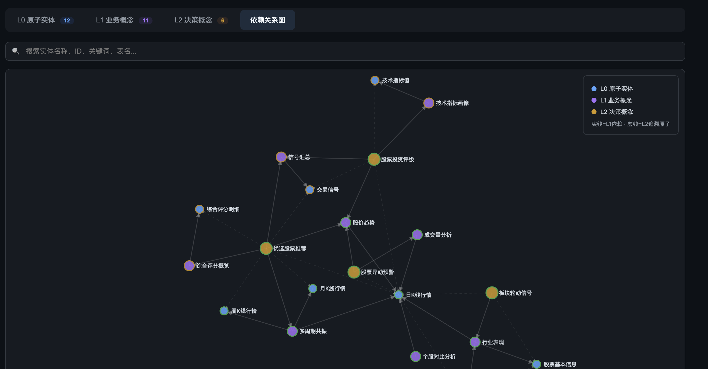
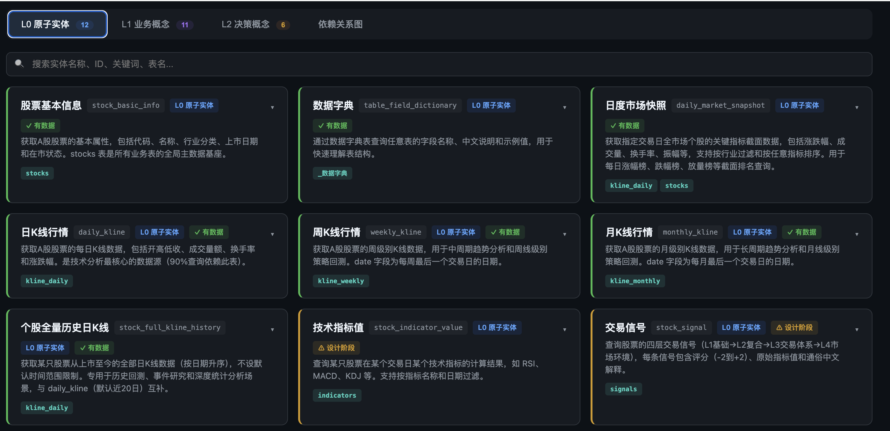
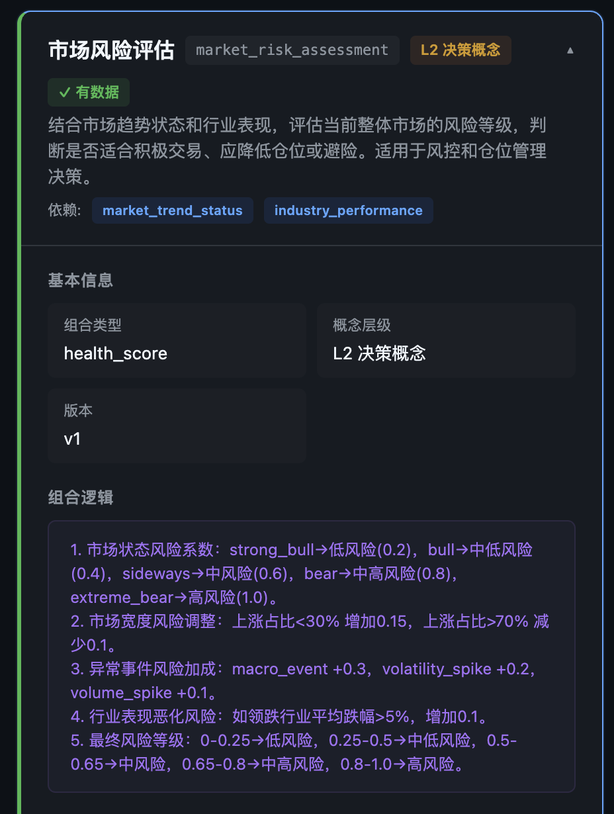

# 语义层构建助手 Skill

本目录是一个用于辅助开发者构建业务语义层的 Skill。它帮助开发者从数据表、字段、指标口径、典型用户问题和历史 SQL 中，抽象出可被智能体稳定调用的语义层。

## 这个 Skill 做什么

它支持：

- 判断当前信息是否足够构建语义层。
- 识别缺失信息并生成追问问题。
- 从数据表中抽象 L0 原子实体。
- 构建最多两层概念层：
  - L1 业务概念：只能依赖 L0 原子实体。
  - L2 决策概念：依赖 L1 概念，必要时少量依赖 L0 原子实体。
- 生成用户问题到概念、实体、SQL 的映射样例。
- 生成推荐的语义层目录结构。
- 在项目根目录生成 `semantic-layer-entities.html`，汇总展示所有实体相关信息。
- 校验语义层依赖、SQL 模板、概念层级和映射引用。

## 推荐使用方式

在支持 Skill 的智能体环境中，让智能体加载本目录的 Skill，然后提出类似请求：

```text
请使用 semantic-layer-builder，基于以下数据表、指标口径和典型用户问题，判断信息是否足够，并生成初版语义层。
```

建议输入包括：

```text
业务场景：
...

数据表 / DDL：
...

指标口径：
...

典型用户问题：
...

可选：权限边界：
...
```

## 最小输入

候选语义层至少需要：

1. 业务场景。
2. 相关数据表结构或 DDL。
3. 核心指标口径，或至少给出需要确认的指标名称。
4. 时间字段和默认时间语义。
5. 表关系；如果未知，需要明确标记未知。
6. 至少 3 个典型用户问题。

权限边界是可选项。生产环境、多角色访问或敏感字段场景建议补充。

## 输出目录约定

默认生成的语义层保存到：

```text
./
├── semantic-layer-entities.html
└── semantic-layer/{domain}/
    ├── README.md
    ├── semantic-layer.yaml
    ├── entities/
    │   ├── atomic.yaml
    │   └── concepts.yaml
    ├── sql/
    │   └── *.sql
    ├── mappings/
    │   └── query-examples.yaml
    ├── tests/
    │   └── semantic-layer-tests.yaml
    └── dist/
        └── semantic-layer.json
```

如果项目已有 `config/`、`sematic-layer/`、`metadata/` 或 `knowledge/` 等目录约定，应优先遵循项目约定。

## 根目录实体信息 HTML

每次最终交付语义层时，都必须在项目根目录生成：

```text
semantic-layer-entities.html
```

该文件用于把 `entities/atomic.yaml` 和 `entities/concepts.yaml` 中的实体信息整理成一份可浏览页面，方便开发者和业务人员评审。

至少包含：

- L0 原子实体总览，且每个 L0 原子实体必须展示 SQL 模板原文。
- L1 业务概念总览。
- L2 决策概念总览。
- `L2 → L1 → L0 原子实体` 依赖关系树。
- SQL 模板或 SQL 文件引用摘要；如果实体使用 `sql_template_ref` 指向 `.sql` 文件，HTML 中也必须嵌入该 SQL 文件的完整原文。
- 假设、风险、缺失口径和权限边界状态。

HTML 应使用内联 CSS，不依赖外部资源。

### 产物示意图

以下是语义层产物的典型结构示意：

**概念间依赖关系总图** — 展示 L2 决策概念、L1 业务概念、L0 原子实体之间的分层依赖关系：



**L0 原子实体概念图** — 列出所有 L0 原子实体及其关键属性、SQL 模板映射：



**概念与 L0 算子间语义依赖关系示例** — 具体展示某个业务概念如何追溯到 L0 算子：



## 基于语义层产物编写问数问答智能体

语义层产物本身不是一个完整的问数问答智能体，它是智能体理解业务问题、定位概念和生成 SQL 的知识与约束。要基于语义层编写问数问答智能体，推荐把以下内容放入同一个 agent 工程目录中：

```text
qa-agent/
├── AGENTS.md 或 CLAUDE.md          # 主智能体说明：如何使用语义层回答问数问题
├── semantic-layer/                 # 本 Skill 生成的语义层产物
│   └── {domain}/
│       ├── semantic-layer.yaml
│       ├── entities/
│       │   ├── atomic.yaml
│       │   └── concepts.yaml
│       ├── sql/
│       │   └── *.sql
│       ├── mappings/
│       │   └── query-examples.yaml
│       └── tests/
│           └── semantic-layer-tests.yaml
├── semantic-layer-entities.html    # 面向开发者和业务人员的实体总览
└── database/                       # 原始数据库接入方式
    ├── README.md                   # 连接方式、权限、只读账号、查询限制
    ├── connection.example.env      # 示例连接参数；不要提交真实密钥
    └── query_tool.py / db_client.*  # 可选：封装好的只读查询工具
```

在 Claude Code 或类似编码智能体中，最简单的做法是：

1. 将 `semantic-layer/`、`semantic-layer-entities.html` 和数据库接入说明放入同一个项目文件夹。
2. 在 `AGENTS.md`、`CLAUDE.md` 或主智能体提示词中明确说明问数流程。
3. 主智能体回答问题时，先读语义层，再选择 L2 / L1 / L0 实体，最后通过数据库接入方式执行 SQL。
4. 数据库连接信息只提供给运行环境或本地配置文件，不要写进语义层定义或提交到仓库。

主智能体说明可以写成：

```text
你是一个问数问答智能体。回答业务数据问题时，必须遵循以下流程：

1. 先阅读 semantic-layer/{domain}/semantic-layer.yaml，确认语义层范围、SQL 方言、默认时间语义和风险说明。
2. 根据用户问题匹配 concepts.yaml 中的 L2 决策概念或 L1 业务概念。
3. 沿依赖关系追溯到 entities/atomic.yaml 中的 L0 原子实体。
4. 读取 L0 原子实体中的 sql_template 或 sql_template_ref 对应的 SQL 文件原文。
5. 根据用户问题补齐时间范围、筛选条件和必要参数；缺少关键参数时先追问，不要编造。
6. 通过 database/ 中约定的只读数据库接入方式执行 SQL。
7. 将 SQL 结果按 L0 fact_interpretation_template、L1 interpretation_rule 和 L2 answer_template 解释成业务语言。
8. 回答中说明使用了哪些概念、哪些 L0 原子实体、关键过滤条件和必要假设。
9. 如果语义层没有覆盖该问题，明确说明无法可靠回答，并提出需要补充的实体、口径或数据表。
```

因此，问数问答智能体的核心不是重新发明业务口径，而是把三类信息放在同一个可访问上下文中：

- **语义层产出物**：负责定义业务概念、L0 原子实体、SQL 模板、解释规则和映射样例。
- **原始数据库接入方式**：负责提供安全、只读、可审计的查询能力。
- **主智能体说明**：负责规定 `用户问题 → 概念 → L0 原子实体 → SQL → 数据事实 → 业务回答` 的执行流程。

## 文件说明

- `SKILL.md`：Skill 主说明，包含触发描述、工作流、建模规则、结构化思考协议和校验要求。
- `agents/openai.yaml`：Skill 在界面中的展示元数据。
- `references/information-checklist.md`：信息充分性评分和追问策略。
- `references/entity-schema.md`：L0 原子实体、L1 概念、L2 概念字段契约。
- `references/concept-modeling-guide.md`：两层概念建模规则和反模式。
- `references/query-mapping-guide.md`：用户问题到概念和实体的映射方法。
- `references/sql-safety-guide.md`：SQL 生成安全规则。
- `references/output-layout.md`：语义层输出目录和文件职责。
- `references/examples.md`：紧凑示例。
- `scripts/validate_semantic_layer.py`：语义层结构校验脚本。
- `scripts/generate_entity_template.py`：根据 schema JSON 生成候选 L0 原子实体模板。

## 校验语义层

生成语义层后，可以运行：

```bash
python3 scripts/validate_semantic_layer.py semantic-layer/sales
```

输出：

```text
语义层校验通过。
```

如果需要 JSON 格式结果：

```bash
python3 scripts/validate_semantic_layer.py semantic-layer/sales --json
```

## 从 schema 生成候选 L0 原子实体

准备一个简单 schema JSON：

```json
{
  "domain": "sales",
  "tables": [
    {
      "name": "orders",
      "columns": [
        { "name": "id", "type": "bigint" },
        { "name": "paid_at", "type": "timestamp" },
        { "name": "actual_pay_amount", "type": "decimal" },
        { "name": "status", "type": "varchar" }
      ]
    }
  ]
}
```

运行：

```bash
python3 scripts/generate_entity_template.py schema.json --table orders
```

输出候选 L0 原子实体 JSON。注意：自动生成的实体只是候选模板，字段业务含义、时间字段、状态过滤和聚合口径仍需人工确认。

## 核心约束

- 每个 L0 原子实体必须可落到 SQL。
- 概念层最多 2 层。
- L1 只能依赖 L0 原子实体。
- L2 不得依赖其他 L2。
- 禁止循环依赖。
- 不要静默臆造业务口径；无法确认的内容必须写入 `assumptions`。
